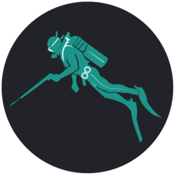

<p align="center">
  
</p>

[](LICENSE.md)


[](https://github.com/GitHarpon/git-harpon/watchers)
[](https://github.com/GitHarpon/git-harpon/stargazers)
[](https://github.com/GitHarpon/git-harpon/network/members)

# Introduction

Cette application a été réalisée par des étudiants de Master 1 Génie de l'Informatique Logicielle. Il s'agit d'une réponse à un appel d'offre de Guillaume Leroy et Hugo Mochet. L'application doit correspondre à [GitKraken](https://www.gitkraken.com/), une interface graphique de git, mais de façon libre et open-source (licence MIT).

Pour cela, nous avons utilisé :

- Angular v7.1.4
- Electron v2.0.7
- Electron Builder v20.28.1
- Bootstrap 4
- le [kit de démarrage](https://github.com/maximegris/angular-electron) de maximegris

# Prérequis

Pour assurer le fonctionnement de cette application depuis n'importe quel OS, il est nécessaire d'avoir installé Node.js.

Nous utiliserons aussi yarn.

### Installation de Node.js
**Windows et macOS**

Il suffit de se rendre sur le site de [Node.js](https://nodejs.org/en/download/).

**Linux**

```sudo apt install nodejs```

```sudo apt install npm```

 ⚠️ Ne faites jamais de ```sudo npm``` sous Linux et macOS ⚠️


### Installation de yarn

**Windows**

Lancer simplement la commande ```npm install -g yarn```

**Linux et macOS**

Il existe un problème de permissions sur Linux et macOS. Pour résoudre ce dernier, il existe deux solutions :

- Changer les permissions du répertoire /usr/local/
- Changer le préfixe de npm

La procédure à suivre est disponible [ici](https://www.youtube.com/watch?v=bxvybxYFq2o).

Une fois cela fait, lancer 
```npm install -g yarn```

## Getting Started

Cloner le répertoire

```git clone https://gitlab.com/Nemtecl/open-terminal.git```

Installer les dépendances 

```yarn install```

## Structure du projet

|Fichier / Dossier|Description|
|--|--|
|`package.json`| Fichier contenant les dépendandes, les scripts et diverses informations sur le projet. |
|`angular.json`| Fichier de configuration pour Angular. |
|`.travis.yml`| Fichier de configuration pour travis. |
|`main.ts`| Fichier d'entrée pour Electron. |
|`electron-builder.json`| Fichier contenant toutes les informations pour la création d'une release. |
|`node_modules/`| Dossier contenant les modules natifs et installés. |
|`release/`| Dossier contenant la release après génération. |
|`tests/`| Dossier contenant les fichiers de test. |
|`src/styles.scss`| Feuille de style globale. |
|`src/variables.scss`| Feuille des variables de style. |
|`src/assets/`| Dossier contenant les fichiers de traduction. |
|`src/app/components/`| Dossier contenant les composants. |
|`src/app/screens/`| Dossier contenant les écrans. |
|`src/app/app.module.ts`| Le fichier app.module.ts. Il faut y indiquer l'ensemble des modules/services à ajouter. Contient de base plusieurs services et modules utiles (`TranslateModule`, `TranslateLoader`, `HttpClientModule`, `ElectronService`, etc.) |
|`src/app/app-routing.module.ts`| Fichier pour le routing.|
|`src/app/providers`| Dossier contenant les services. |

## Commandes disponibles


Comme expliqué plus haut, nous avons utilisé le kit de démarrage. Le fichier package.json contenait des commandes très utiles, que nous avons donc utilisées.

|Commande|Description|
|--|--|
|`yarn start`| Exécution de l'application en mode développement avec hot reload. |
|`yarn ng:serve:web`| Exécution de l'application dans un navigateur. |
|`yarn build`| Build l'application. Les fichiers de build se trouvent dans le dossier /dist. |
|`yarn build:prod`| Build l'application avec Angular aot. Les fichiers de build se trouvent dans le dossier /dist. |
|`yarn electron:linux`| Sous Linux, build l'application et crée un `.AppImage`. |
|`yarn electron:windows`| Sous Windows, build l'application et crée un `.exe`, exécutable pour les systèmes en 32 et 64 bits. |
|`yarn electron:mac`|  Sous macOS, build l'application et crée un `.dmg` contenant le `.app`. |
|`yarn test:e2e`| Lance les tests end-to-end (e2e) |

⚠️ Il faut supprimer le dossier release avant d'en regénérer un autre ⚠️

## Lancer les tests

Comme expliqué ci-dessus, la commande `yarn test:e2e` lance les tests end-to-end. Cependant, il est nécessaire de créer une release avant de lancer cette commande. 

### Sur macOS

`yarn electron:mac` puis cliquer sur le .dmg généré et mettre le .app dans le dossier release. On peut alors lancer la commande `yarn test:e2e`.

### Sur Linux

`yarn electron:linux` et s'assurer d'avoir lancer une fois le .AppImage pour que la fenêtre de dialogue ne s'affiche plus par la suite. On peut alors lancer la commande `yarn test:e2e`.


### Sur Windows 

`yarn electron:windows` puis lancer la commande `yarn test:e2e`.


## Ajouter un package

```yarn add [package]```

## Supprimer un package

```yarn remove [package]```

## Ajouter un module natif à Node.js

L'application étant lancée avec Electron, il est possible d'ajouter des modules natifs à Node.js.
Pour cela, il suffit de les ajouter au service ElectronService. Plusieurs modules sont déjà disponibles (Child Process, File System, OS, etc.).


# Contributeurs
 * [Cyrielle Angoula Meka](https://github.com/cissouxxx)
 * [Julien Besnier](https://github.com/BesnierJulien)
 * [Martin Blondel](https://github.com/Philiippe)
 * [Clément Drouin](https://github.com/Nemtecl)
 * [Antoine Guillory](https://github.com/antoineguillory)
 * [Julien Lamy](https://github.com/JulienLamy76)
